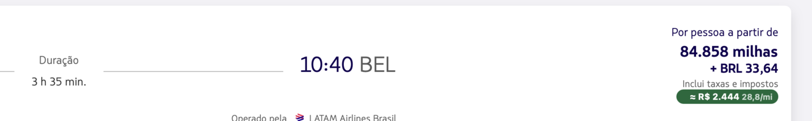

# milheiro

Extensão de browser que, na LATAM, anota cada voo e cada tarifa
com o **R$/milheiro** e o veredito contra o **seu baseline**, direto na interface
deles, no modo milhas (onde a LATAM esconde o preço em dinheiro).



## Stack

TypeScript + [WXT](https://wxt.dev).

## Instalar

### Safari (macOS)

Baixe o `Milheiro.dmg` dos [releases](https://github.com/mracos/milheiro/releases/latest)
e arraste pra `Applications` (ou `brew install --cask mracos/tap/milheiro`). Depois:

1. Abra o Milheiro.app uma vez, é o que registra a extensão. O build é adhoc,
   então o macOS barra a primeira abertura: libere em Ajustes do Sistema >
   Privacidade e Segurança > "Abrir Mesmo Assim".
2. Ligue **Safari > Ajustes > Desenvolvedor > Permitir extensões não assinadas**.
   Sem isso o Safari esconde a extensão da lista, e o toggle desliga sozinho a
   cada vez que o Safari reabre.
3. Habilite em **Safari > Ajustes > Extensões**.

### Chrome / Edge / Brave / Firefox

Baixe o zip dos **artefatos** dos releases.

## Build do zero

### Chrome / Edge / Brave

`npm run build` -> `chrome://extensions` -> Developer mode -> **Load unpacked** -> `.output/chrome-mv3`.

(Ou `npm run dev`, que abre o browser sozinho.)

### Firefox

`npm run build:firefox` -> `about:debugging` -> **Load Temporary Add-on** -> `.output/firefox-mv2/manifest.json`.

### Safari (macOS)

```sh
npm run build:safari    # build + assina o app (não instala)
npm run safari:install  # o mesmo, e copia pra /Applications e abre
```

Build local não passa por download, então não tem quarentena pra tirar. Mas
continua sendo adhoc: vale o mesmo "Permitir extensões não assinadas" de cima,
e aí habilite em Safari > Ajustes > Extensões.

## Testes

```sh
npm test
```
